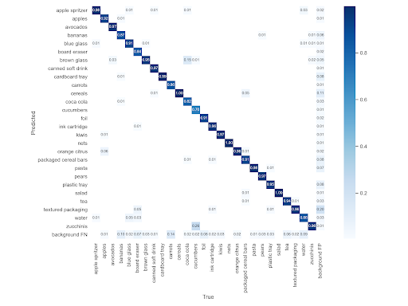

# Project Title

Supermarket Object Detection

# Description

Our project describes the development and prediction model considerations of an object detection system for retail items. 

Ideally, the goal is to automate parts of the retailing experience, namely the checkout procedure in a retail store. 

This is to be achieved by tracking and identifying objects that the customer puts in their physical shopping cart, and then using this information to build a “virtual shopping cart”, which would potentially remove the need for a cashier to scan the items and handle payments in a convenience store.

# Getting Started

### Dependencies

View `conda.yml`

### Installing

`conda env create -f conda.yml`

`conda activate supermarket-objects`

### Executing Program

`python -m src.app`

# Model

### How the model is trained

A pre-trained yolov5 is fine tuned over the MVTec D2S: Densely Segmented Supermarket Dataset. As the dataset is localized to German supermarket products, a general 'supercategory' was extracted from each product's annotations. The yolov5 model was fine-tuned on the images with respect to each of its supercategory.

### The expected format the model requires

The model takes input formats of `jpeg`, `jpg`, and `png`.

### Details about the dataset with which the model was trained

Contains 21,000 high-resolution images with pixel-wise labels as well as bounding boxes of all object instances. Additional 10,000 artificially generated images to augment train dataset. 

Objects comprise groceries and everyday products from 60 categories. Object classes were largely localized to German supermarkets. Instead of using the specific product brand names as the classes, we instead used the available ‘supercategory’ as the target label for each object instance

Resembles the real-world setting of an automatic checkout, inventory, or warehouse system. Training images only contain objects of a single class on a homogeneous background, while the Validation and test sets are much more complex and diverse. The scenes are acquired with different lightings, rotations, and backgrounds to improve robustness of instance segmentation methods

### Performance of the model

### How the model is served

Currently the model is served locally. We aim to deploy the model to a Tekong cluster in the coming future.
